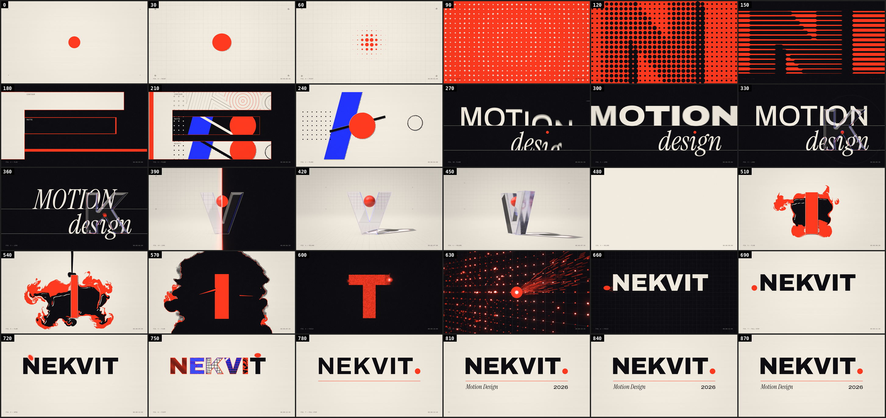

# NEKVIT — Showreel 2026 · „FULL STOP."

15sekundový motion-design showreel (1920×1080, 60 fps, se zvukem). Obraz vykresluje vlastní WebGL2 engine a zvuk procedurální syntezátor, obojí přímo z kódu. Projekt nepoužívá žádné video, obrázky, 3D modely ani samply.



**Video:** [`media/NEKVIT-showreel.mp4`](media/NEKVIT-showreel.mp4)

Vermilionová tečka se narodí na první dobu a putuje písmeny jména N-E-K-V-I-T. Každé písmeno je jedna „stanice“ řemesla:

| Písmeno | Záběr | Co ukazuje |
|---|---|---|
| N | `line` | tisk, rastr, rytina |
| E | `plane` | kompozice render passů, masky |
| K | `lens` | skleněná čočka, kinetická typografie |
| V | `volume` | raymarchované sklo, kaustiky, dolly zoom, DOF |
| I | `flow` | fluidní simulace (Navier–Stokes) |
| T | `field` | ~197 000 částic, kamera za kometou |

Na konci tečka přeskáče po písmenech a dopadne jako tečka za jménem.

---

## Jak dát showreel na web

### Varianta A: video (nejjednodušší, doporučeno)

1. Zkopíruj `media/NEKVIT-showreel.mp4` (a volitelně `media/poster.png`) na svůj web.
2. Vlož do HTML:

```html
<video
  src="NEKVIT-showreel.mp4"
  poster="poster.png"
  controls
  playsinline
  preload="metadata"
  style="width:100%; max-width:1280px; aspect-ratio:16/9; background:#0E0E12;">
</video>
```

Automatické přehrávání ve smyčce (třeba jako pozadí hero sekce) prohlížeče povolí jen bez zvuku:

```html
<video src="NEKVIT-showreel.mp4" autoplay muted loop playsinline
       style="width:100%; aspect-ratio:16/9; object-fit:cover;"></video>
```

Tip: YouTube nebo Vimeo ušetří datový přenos a video tam přizpůsobí kvalitu podle připojení. Na web ho pak vložíš jejich `<iframe>` kódem.

### Varianta B: živý WebGL render v prohlížeči

Reel se vykresluje v reálném čase přímo na grafice návštěvníka. Hodí se jako „wow“ ukázka, ale potřebuje prohlížeč s WebGL2 a slušnou grafickou kartu.

1. Nahraj na hosting celou složku projektu: `index.html`, `src/`, `fonts/`, `audio/`. Složky `tools/` a `media/` nejsou potřeba.
2. Otevři `https://tvuj-web.cz/cesta/index.html`.
3. Chceš ho vložit do jiné stránky? Použij iframe:

```html
<iframe src="/showreel/index.html"
        style="width:100%; max-width:1280px; aspect-ratio:16/9; border:0;"
        allow="autoplay; fullscreen"></iframe>
```

Stránku je nutné servírovat přes HTTP(S) (hosting, GitHub Pages, Netlify…). Po otevření `index.html` dvojklikem z disku nefunguje, protože ES moduly a fonty se načítají přes `fetch`.

Lokálně si ji pustíš takhle:

```bash
npx http-server -c-1 .
# pak otevři http://localhost:8080
```

Ovládání: klik = přehrát se zvukem, mezerník = pauza, ←/→ = po snímku, Shift+←/→ = po 10 snímcích, F = celá obrazovka.

**GitHub Pages:** v nastavení repa zvol *Settings → Pages → Deploy from branch → `main` / root*. Reel pak poběží na `https://nekvit.github.io/motion-showreel/`. U soukromého repa to vyžaduje placený účet.

---

## Jak to technicky funguje

Celý projekt má zhruba 13 000 řádků JavaScriptu a GLSL a nemá žádné runtime závislosti. Nepoužívá three.js, GSAP ani Tone.js. Obraz počítá grafická karta přes **WebGL2**. Zvuk počítá Node.js skript vzorek po vzorku. Z cizích věcí jsou v projektu jen fonty (licence OFL) a nástroje pro export (Playwright, ffmpeg).

### 1. Základní princip: snímek = funkce čísla snímku

Reel má 900 snímků (15 s × 60 fps). Každý snímek je **čistá funkce svého čísla** `n`. Kód nepoužívá `Math.random()`, `Date` ani reálný čas. Náhodnost obstarávají celočíselné hashe (PCG), které dávají na každém stroji stejný výsledek.

Díky tomu:
- jde kterýkoli snímek vykreslit samostatně a vždy vypadá stejně,
- stejný kód umí přehrávat reel živě v prohlížeči i exportovat video snímek po snímku,
- zvuk sedí na obraz na vzorek přesně: snímek `n` začíná na vzorku `n × 800` (48 kHz / 60 fps).

### 2. Engine (`src/engine.js`, `src/gl.js`)

Tenká vrstva nad WebGL2. Hlavní části:

- **`Program`**: kompiluje shadery a sám nastavuje uniformy podle typu (čísla, vektory, matice, textury).
- **`FBO` / `PingPong`**: render do textur ve formátu RGBA16F / RGBA32F, tedy HDR s plovoucí čárkou. Ping-pong jsou dvě textury, které se střídají jako „minulý / příští stav“. Používají je simulace.
- **Fullscreen pass**: většina obrazu vzniká jako jeden trojúhelník přes celou obrazovku. Fragment shader pak spočítá barvu pro každý pixel.
- **Časová osa** (`src/timeline.js`): 8 záběrů, každý má rozsah `[start, end)` ve snímcích a volitelný **overlap**.
- **Přechody** řídí příchozí záběr. Během overlapu engine vykreslí i odcházející záběr (pokračuje za svůj konec) a předá ho jako texturu `s.prevTex`. Příchozí záběr ho pak sám „prolne“: maskou, světelnou rovinou, halftone buňkami, inkoustovou maskou z alfa kanálu apod.
- **Stavové záběry** (fluid, částice) mají metody `reset()` a `step()`. Když se vykresluje snímek uprostřed záběru, engine simulaci deterministicky přehraje od prvního snímku s pevným krokem `dt = 1/60`.
- **Motion blur**: záběr přes `mb(f)` řekne, kolik vzorků chce (typicky 6). Engine ho vykreslí 6× v časech rozložených v rámci půl snímku (závěrka 180°) a zprůměruje je v HDR.
- **Kontinuita postprocessingu**: záběr exportuje `postOut` (bloom, vinětace…) a následující záběr na něj prvních 12 snímků plynule navazuje (`ctx.setPost`).

Záběr je obyčejný ES modul:

```js
export default {
  id: 'point',
  init(ctx) { /* kompilace shaderů, textury, předpočty */ },
  mb: f => 6,                       // počet vzorků motion bluru
  render(ctx, s) {                  // s.t = čas v záběru, s.frame = globální snímek
    ctx.draw(this.prog, { uT: s.t }, s.target);
    ctx.setPost(s, { bloom: 0.2 });
  },
};
```

### 3. Obraz: techniky ve shaderech

**Signed distance fields (SDF).** Tvar se popíše funkcí „jak daleko jsem od okraje“ (záporná hodnota = uvnitř). Kruh je `length(p) - r`. Z SDF se dá odvodit vyhlazená hrana (`fwidth`), obrys, stín, zvětšení i zkosení. Na SDF stojí skoro celý reel.

**Písmo jako SDF** (`src/text.js`, `src/sdf.js`, `src/shots/_sys.js`). Písmeno se vykreslí přes Canvas 2D (Archivo 850) do velkého rastru. Z něj se přesnou euklidovskou distanční transformací (Felzenszwalb–Huttenlocher) spočítá pole vzdáleností. Shadery ho pak čtou jako `glyphD(q)`. Díky tomu:
- tečka (kulička) opravdu dosedne do vrubu V, na diagonálu N nebo rameno K; `restY` hledá bod dotyku kružnice s písmem,
- písmena mohou být ze skla, z pigmentu i z prachu a pořád mají přesně stejný tvar,
- celý layout titulku (pozice písmen, tečka za jménem, linka, role, rok) se počítá z reálných metrik fontu. Po změně jména v `config.js` se všechno přepočítá.

**Variabilní fonty.** Archivo má osy tloušťky (100–900) a šířky (62–125). Canvas 2D neumí šířku nastavit plynule, proto engine zaregistruje 284 aliasů fontu s „připíchnutou“ šířkou (po 1 a v rozsahu 100–125 po 0,25). Díky tomu může „weight wave“ v záběru `lens` hladce animovat obě osy.

**Tiskový jazyk (point, line, plane).** Halftone rastr pootočený o 45°, plochy vznikají po „tiskových deskách“ podle rytmu, tečky se natahují do kapslí, které tvoří linky rytiny jako na bankovce. Záběr `plane` ukazuje jednu kompozici ve třech render passech najednou (CONTOUR = izolinie SDF, MATTE = siluety, BEAUTY = finální vzhled) v oknech ve tvaru písmene E.

**Skleněná čočka (lens).** 2D refrakce: z gradientu SDF písmene K se spočítá normála zkosené hrany. Pozadí s kinetickou typografií se podle ní posune a vzorkuje dvakrát s mírně jiným posunem. Tak vzniká disperze, omezená jen na osu vermilion–kobalt. K tomu Fresnelův odraz studia, Beer–Lambertův útlum a lesk jedoucí po hraně.

**3D sklo (volume).** Tady žádný 3D model není:
- **Raymarching**: pro každý pixel se z kamery vyšle paprsek, který „kráčí“ po SDF vytaženého písmene V, dokud nenarazí na povrch. SDF je pro přesnost nahrazeno přesným polygonem (marching squares → Douglas–Peucker → 19 vrcholů).
- **Refrakce** podle Snellova zákona při vstupu i výstupu, pro dva indexy lomu (1,47 a 1,53). Rozdíl mezi nimi dává disperzi.
- **Kaustika**: při startu se přes sklo vystřelí stovky tisíc paprsků od světla a jejich dopady na podlahu se sečtou do textury. Za běhu je kaustika jen jedno čtení textury.
- **Studio**: podlaha, zaoblený cyklorama, mřížka s filtrováním podle vzdálenosti, měkké stíny, AO a odlesky softboxů.
- **Kamera**: dolly zoom (FOV se mění a vzdálenost s ním, takže V drží velikost a svět za ním se roztahuje), orbit o 90° a hloubka ostrosti (16 vzorků ve zlatém úhlu).
- Primární paprsky jdou v polovičním rozlišení. Hrany a sklo se pak dopočítají v plném rozlišení a pohyb dostane rychlostní motion blur.

**Fluidní simulace (flow).** Numerické řešení Navierových–Stokesových rovnic na mřížce 384×216:
- advekce (MacCormack), divergence, 20 Jacobiho iterací tlaku, odečtení gradientu tlaku a vorticity confinement pro vířivé „inkoustové“ chování,
- písmeno I je pohyblivá stěna: její tloušťka pulzuje do rytmu a rozhrnuje barvivo,
- barvivo (vermilion a inkoust) se nekreslí plynule, ale **posterizuje** jako sítotisk: tvrdé hrany, halftone na přechodech a mokrý lesk z gradientu výšky,
- alfa kanál nese inkoustovou masku, kterou pak použije následující záběr jako přechod.

**Částice (field).** 196 608 zrn (512×384):
- poloha a rychlost každého zrna jsou uložené v texturách RGBA32F (MRT ping-pong) a celá fyzika běží ve fragment shaderu,
- zrna nejdřív tvoří písmeno T, pak je rozfouká curl noise (bezdivergenční šumové pole), pak se pružinami přichytí k 3D mřížce 60px modulu a nakonec se „stratifikovaně“ rozdělí přesně na pixely rastru jména NEKVIT,
- vykreslují se jako instancované gaussovské sprity s aditivním blendingem. Velikost roste s rozostřením (DOF) a sprity se natahují ve směru pohybu (motion blur),
- 4 096 zrn tvoří kometu, kterou sleduje kamera (Catmull-Rom trajektorie).

**Titulek (full-stop).** Přechod z částic halftone buňkami, které rostou od tečky. Tečka pak skáče po písmenech a v každém otevře „okno“ do živého mini-světa předchozí stanice (každý je jedna shader funkce). Při dopadu na 768. snímku písmena zatěžknou, okna se zavřou, vystřelí kruh a vykreslí se linka. Pak se „vytiskne“ role a rok.

### 4. Postprocessing (`src/post.js`)

Všechno se kreslí v lineárním HDR. Na konci jeden řetězec:
1. **Bloom**: 6úrovňová pyramida (13-tap downsample s Karisovým průměrem, tent upsample), jen nad prahem 1,05. Plochá vermilionová se proto nerozzáří.
2. **Chromatická aberace, soudkové zkreslení, zoom blur, otřes kamery.**
3. **Tonemap „PRINT“**: hodnoty ≤ 1 zůstávají přesně na svém hexu, vyšší zachovají odstín a přejdou do teplé bílé. Barvy palety se tak zobrazí přesně a jen světla „přepálí“.
4. **Vinětace, filmové zrno** (deterministické, vážené jasem), přesná sRGB konverze a dither proti pruhování.
5. **HUD**: technický popisek `FIG. n — …` a SMPTE timecode, kreslený až za tonemapem, aby ho neovlivnily efekty.

### 5. Zvuk (`tools/soundtrack.mjs`)

Offline syntezátor bez závislostí, výstup je `audio/soundtrack.wav` (48 kHz, 16 bit, stereo, přesně 720 000 vzorků).

- **Stavební kameny**: oscilátory s fázovým akumulátorem, saw s polyBLEP (bez aliasingu), biquad filtry s modulací frekvence, obálky, 2-operátorová **FM syntéza**, seeded šum, bitcrusher, equal-power panorama.
- **Nástroje**: kick (sinus s pádem výšky 150 → 45 Hz), 808 sub, clap/snare (šumové bursty + tělo), hi-haty, „reese“ bas (dvě rozladěné pily), FM zvonky, pluck tečky (hlavní „podpisový“ zvuk), pad, whooshe, risery, granulární textury a UI tiky.
- **Prostor**: konvoluční reverb s generovanou odezvou (exponenciálně doznívající šum) přes FFT overlap-add.
- **Mastering**: sidechain kompresí basu na kick, mono pod 120 Hz, glue kompresor, true-peak limiter (−1 dBTP) a normalizace na −14 LUFS podle BS.1770.
- **Cue list**: každý zvuk má snímek z `DIRECTION.md` §3. Dvě pauzy před velkými momenty jsou přesná digitální nula.
- `tools/audiocheck.mjs` zvuk ověřuje analýzou: nástupy na správných snímcích, hlasitost, špičky, kliky a ticho.

### 6. Export videa (`tools/render.mjs`)

1. Spustí lokální HTTP server a headless Chromium (Playwright) se softwarovým WebGL (SwiftShader), takže nepotřebuje GPU.
2. Pro každý snímek zavolá `__reel.capture(n)` a výsledek uloží jako PNG. Na 4jádrovém serveru to trvá zhruba 1 s na snímek.
3. ffmpeg složí PNG a WAV do H.264/AAC MP4.

### 7. Jak projekt vznikal

Kód napsal AI model Claude (Anthropic) v Claude Code, organizovaný jako tým agentů:
- **Zadání**: tři agenti navrhli konkurenční storyboardy, tři „porotci“ je ohodnotili (art direction, timing, technická proveditelnost), jeden je sloučil a tři kritici prověřili výsledek. Vzniklo `DIRECTION.md`, závazné zadání s přesností na snímek.
- **Stavba**: engine a sdílená knihovna, pak jeden agent na každý záběr. Agenti si průběžně renderovali snímky a prohlíželi je jako obrázky.
- **Kontrola**: u každého záběru dva nezávislí kritici (umělecký a technický) renderovali a měřili pixely, potom přišly opravy a druhé kolo.
- **Zvuk**: ladil se analýzou signálu (spektrum, hlasitost, časování), ne poslechem.

---

## Úpravy

- **Jméno, role, rok:** `src/config.js` (`name`, `role`, `year`). Layout se přepočítá sám pro 2–11 písmen.
- **Zvuk po změně jména:** `node tools/soundtrack.mjs` (vytvoří `audio/soundtrack.wav`).
- **Vyrenderování videa:** `node tools/render.mjs --all --video out/showreel.mp4 --workers 2`. Potřebuje Node 22, Playwright s Chromiem a ffmpeg (nebo `pip install imageio-ffmpeg`).
- **Náhled jednoho záběru:** `node tools/render.mjs --shot volume --step 6 --scale 0.5 --sheet`

## Dokumentace

- [`DIRECTION.md`](DIRECTION.md): umělecké a technické zadání (paleta, typografie, časování na snímek, cue list zvuku)
- [`ENGINE.md`](ENGINE.md): API enginu pro psaní záběrů
- [`SYS.md`](SYS.md): sdílená knihovna layoutu a glyfů

Fonty (Archivo, Instrument Serif, JetBrains Mono, Unbounded) jsou pod licencí SIL OFL, viz `fonts/`.
